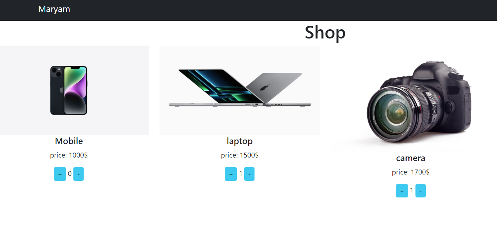
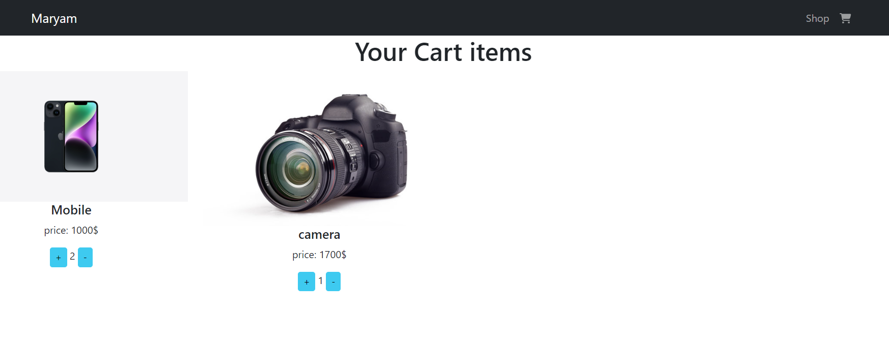

### Online Shopping

## Existing Online Shopping

create a shopping cart for the customer

`customer can choose  your product `

`create shopping cart`

`deploy`
### creathing Online Shopping in Reacht.js

# Getting started

## stack management

1. Open a command prompt at the root of the application's folder.

2. `npm run start`

